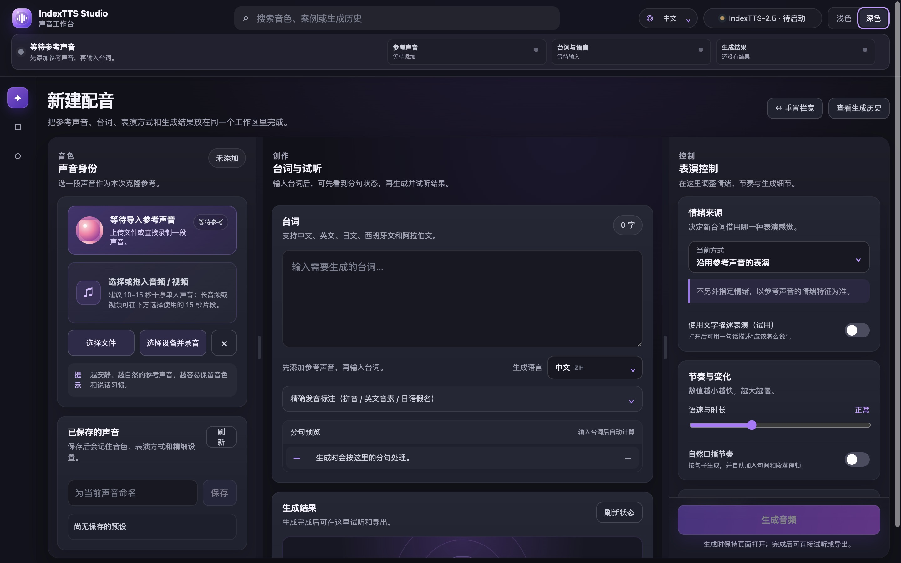
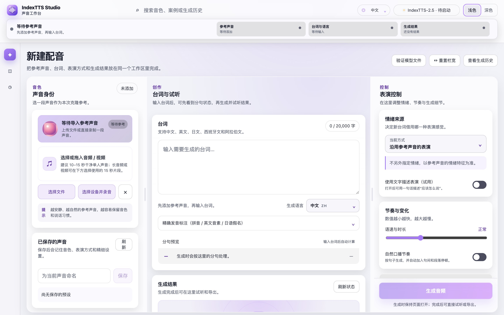
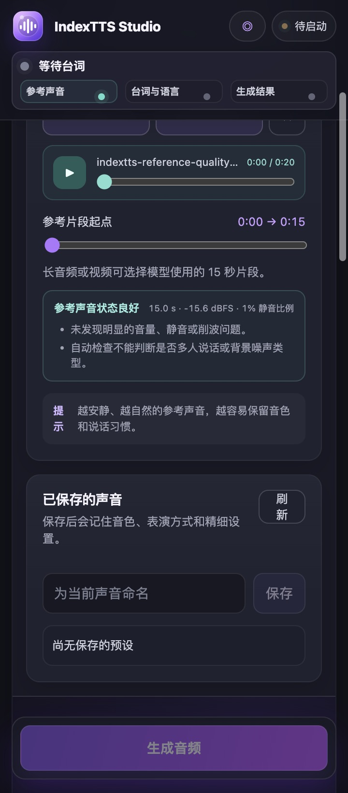
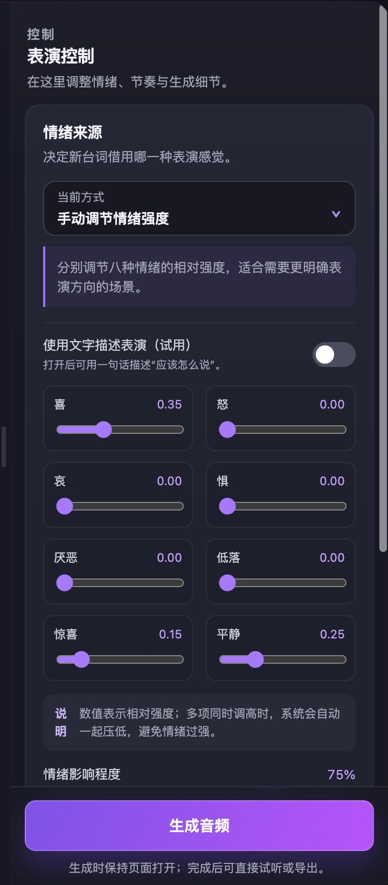
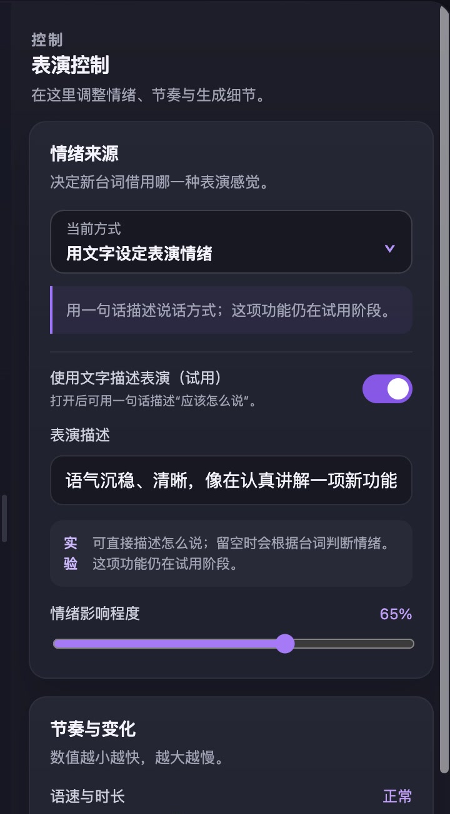
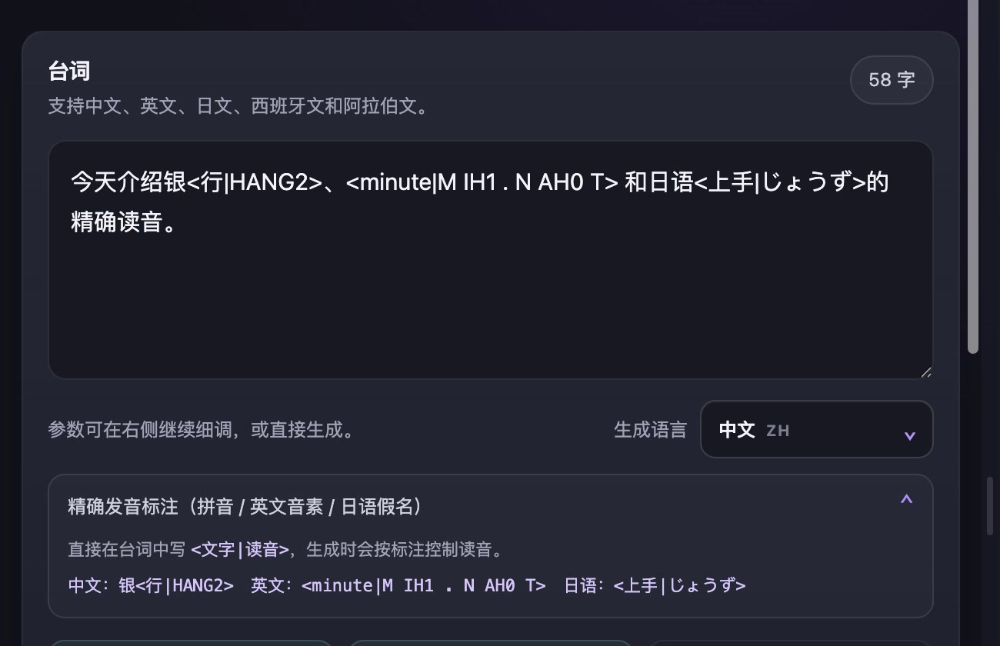
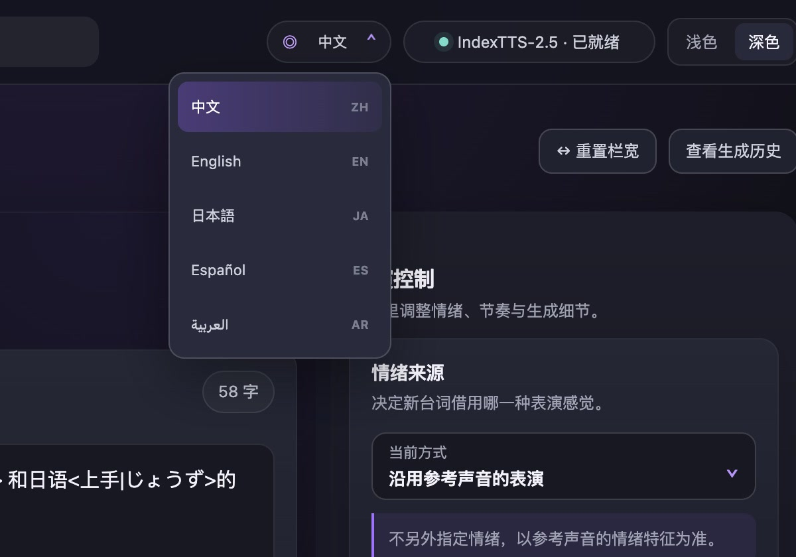
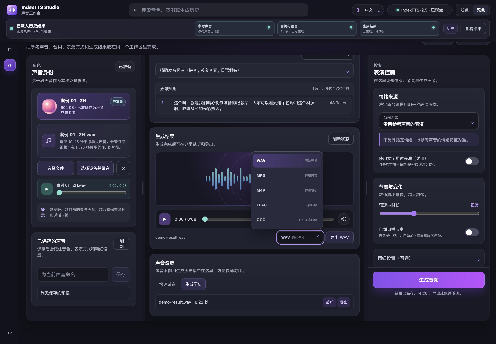
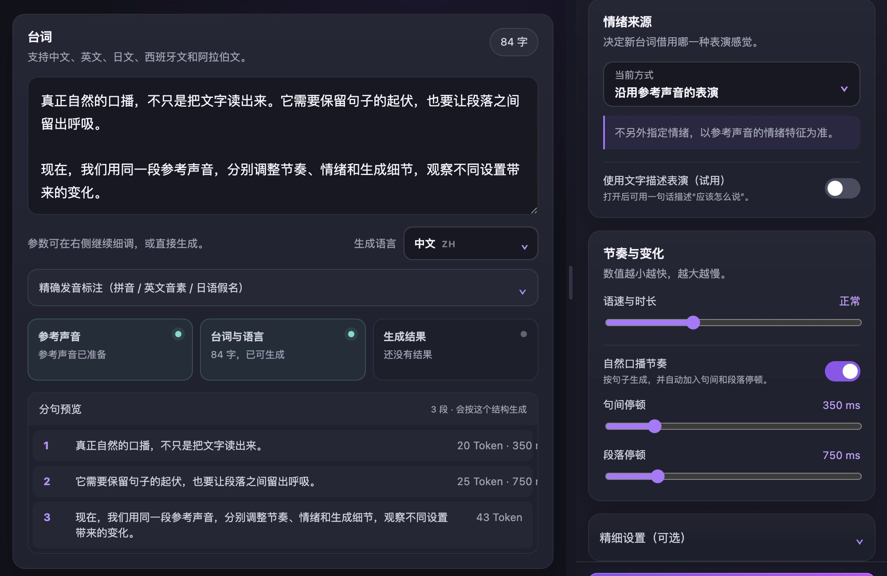

<div align="center">


# IndexTTS Studio

[简体中文](README.md) · [English](README_EN.md) · [日本語](README_JA.md) · [Español](README_ES.md) · [العربية](README_AR.md)

**基于 IndexTTS 2.5 的本地多语言声音工作台**

Local-first multilingual voice cloning and speech generation workspace.

[](https://github.com/index-tts/index-tts)


[](LICENSE)

[使用文档](STUDIO_README_ZH.md) · [许可说明](OPEN_SOURCE_NOTICE.md) · [IndexTTS 项目](https://github.com/index-tts/index-tts)

</div>

<table>
  <tr>
    <td align="center">
      
      <br /><sub>深色模式</sub>
    </td>
    <td align="center">
      
      <br /><sub>浅色模式</sub>
    </td>
  </tr>
</table>

## 功能演示

<table>
  <tr>
    <td width="50%" align="center">
      
      <br /><strong>参考片段与质量检查</strong>
      <br /><sub>选择模型使用的 15 秒声音，并检查音量、静音和削波</sub>
    </td>
    <td width="50%" align="center">
      
      <br /><strong>八维情绪控制</strong>
      <br /><sub>分别调节喜、怒、哀、惧等八种情绪和影响程度</sub>
    </td>
  </tr>
  <tr>
    <td width="50%" align="center">
      
      <br /><strong>文字描述表演</strong>
      <br /><sub>用一句话描述语气和表达方式</sub>
    </td>
    <td width="50%" align="center">
      
      <br /><strong>精确发音标注</strong>
      <br /><sub>支持中文拼音、英文 CMU 音素和日语假名</sub>
    </td>
  </tr>
  <tr>
    <td width="50%" align="center">
      
      <br /><strong>多语言界面</strong>
      <br /><sub>界面语言与生成语言分别选择</sub>
    </td>
    <td width="50%" align="center">
      
      <br /><strong>生成、试听与导出</strong>
      <br /><sub>实时 Token 状态、播放器和五种导出格式</sub>
    </td>
  </tr>
</table>

<p align="center">
  
  <br /><strong>自然口播与分句预览</strong>
  <br /><sub>分别设置句间和段落停顿，并预览模型使用的分段结构</sub>
</p>

## 项目简介

IndexTTS Studio 是一个运行在浏览器中的 IndexTTS 2.5 本地可视化工作台，用于处理参考声音、台词、表演控制、生成进度、试听和导出。参考音频与生成结果保存在运行服务的设备上。

项目同时提供 IndexTTS 命令行、Gradio WebUI 和 Studio 界面。模型权重需要单独下载，使用许可见 [LICENSE](LICENSE)。

## 主要功能

- 导入音频或视频，也可选择录音设备直接录制。
- 长音频和视频可选择模型使用的 15 秒参考片段。
- 支持中文、英文、日文、西班牙文和阿拉伯文；界面语言与生成语言相互独立。
- 支持参考声音情绪、独立情绪音频、八维情绪向量和文字情绪描述。
- 支持语速、随机生成、候选范围、重复抑制和分段上限等参数。
- 支持拼音、英文 CMU 音素和日语假名发音标注。
- 提供自然口播停顿、分句预览、实时 Token 进度、预设和生成历史。
- 自动检查参考声音的时长、音量、静音和削波；生成任务可取消。
- 生成历史支持单条删除和清空，并自动保留最近 100 条或最多 5 GB。
- 可导出 WAV、MP3、M4A、FLAC 和 OGG；实际格式取决于本机 FFmpeg。
- 为 Apple M 系列 Mac 提供 MPS 推理与 BigVGAN CPU 兼容路径。

## 快速开始

需要 Python 3.10 或 3.11、[uv](https://docs.astral.sh/uv/) 和 FFmpeg。

```bash
git clone https://github.com/luu175ktovtsvor-spec/IndexTTS-Studio-Open.git
cd IndexTTS-Studio-Open

uv sync --extra studio --locked
```

下载 IndexTTS 2.5 模型权重：

```bash
uv tool install huggingface-hub
hf download IndexTeam/IndexTTS-2.5 --local-dir=checkpoints
uv run python -m indextts.utils.model_integrity checkpoints
```

启动 Studio：

```bash
uv run --extra studio --locked python studio_server.py
```

随后打开 [http://127.0.0.1:7860](http://127.0.0.1:7860)。macOS 和 Linux 也可以运行：

```bash
./start-studio.sh
```

更换端口：

```bash
INDEXTTS_STUDIO_PORT=7861 ./start-studio.sh
```

这里的 `INDEXTTS_STUDIO_PORT` 只会更换自写 Studio 的端口，不会启动上游 Gradio。默认和公开交付界面均为 Studio（7860）。如需临时使用上游原生 WebUI，可在另一个终端运行：

```bash
./start-native-webui.sh
# 等价命令：uv run --extra webui --locked python webui.py --host 127.0.0.1 --port 7861
```

两套界面可以同时打开，但会使用两个独立模型进程，因此不会默认双开。退出各自的启动终端即可安全停止对应服务。

运行 Studio 回归测试：

```bash
./tools/test-studio.sh
```

## 平台说明

- CUDA、DeepSpeed 和 CUDA 内核用于 NVIDIA GPU 加速。
- Studio 的 Mac 路径面向 M1 及后续 Apple M 系列芯片，包括 Pro、Max 和 Ultra。
- Windows 和 Linux 保留 Python 启动路径，但本轮未做实机验证；录音功能在远程部署时需要 HTTPS。

## 项目结构

```text
studio/                 Studio 前端与多语言资源
studio_server.py        本地 API、生成状态与文件服务
studio_engine.py        Apple silicon 兼容层
start-studio.sh         macOS / Linux 启动脚本
start-native-webui.sh   可选的上游 Gradio 启动脚本
tools/test-studio.sh    可复现的 Studio 回归测试
STUDIO_README_ZH.md     详细使用说明
OPEN_SOURCE_NOTICE.md   许可与修改说明
```

## 项目与许可

IndexTTS Studio 基于 [IndexTTS 2.5](https://github.com/index-tts/index-tts) 开发。模型、论文和权重信息见 IndexTTS 项目；使用许可和修改说明见 [LICENSE](LICENSE) 与 [OPEN_SOURCE_NOTICE.md](OPEN_SOURCE_NOTICE.md)。

- [IndexTTS 项目](https://github.com/index-tts/index-tts)
- [IndexTTS 中文文档](docs/README_zh.md)
- [Studio 使用文档](STUDIO_README_ZH.md)
- [许可证](LICENSE)
- [修改说明](OPEN_SOURCE_NOTICE.md)
