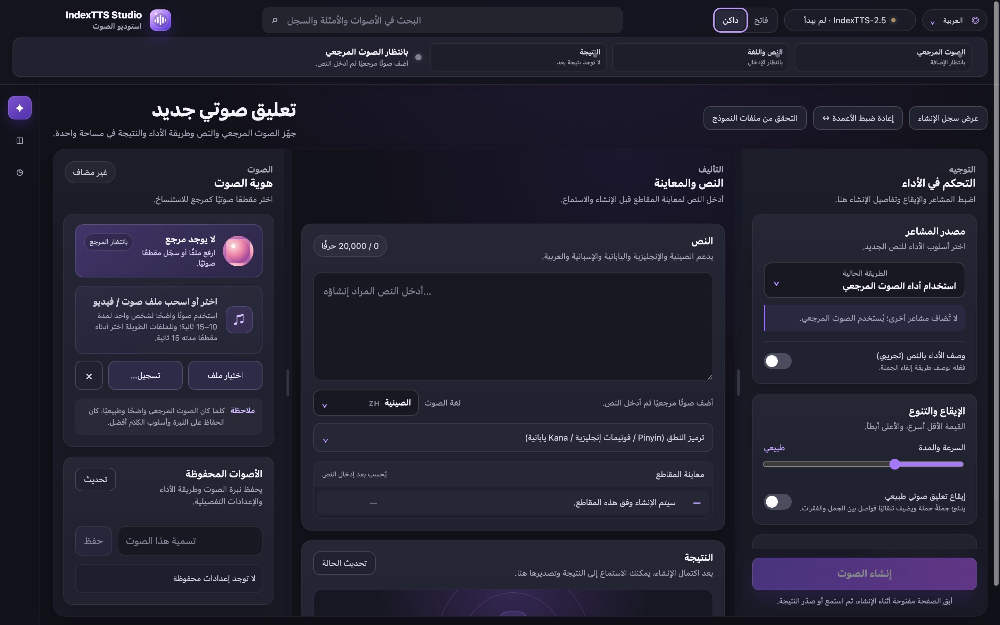
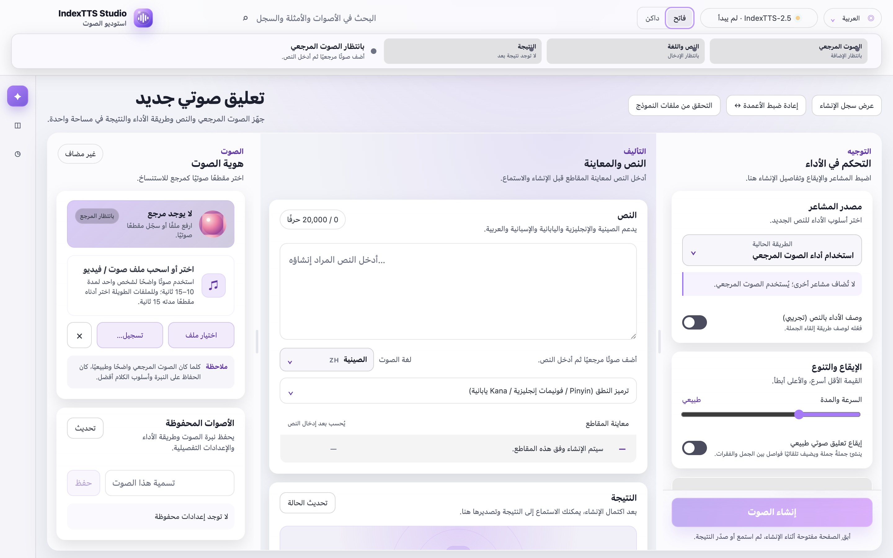
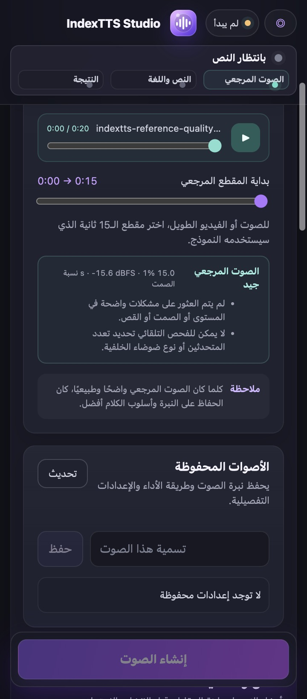
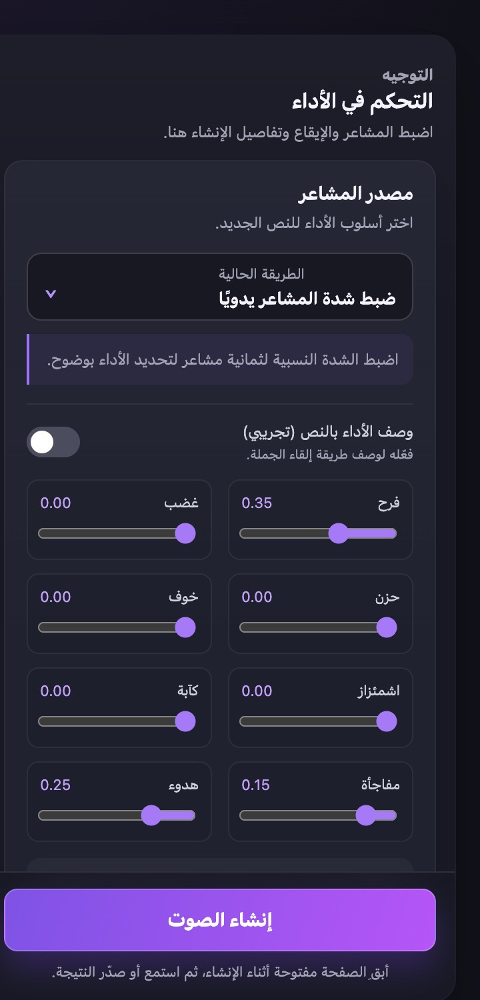
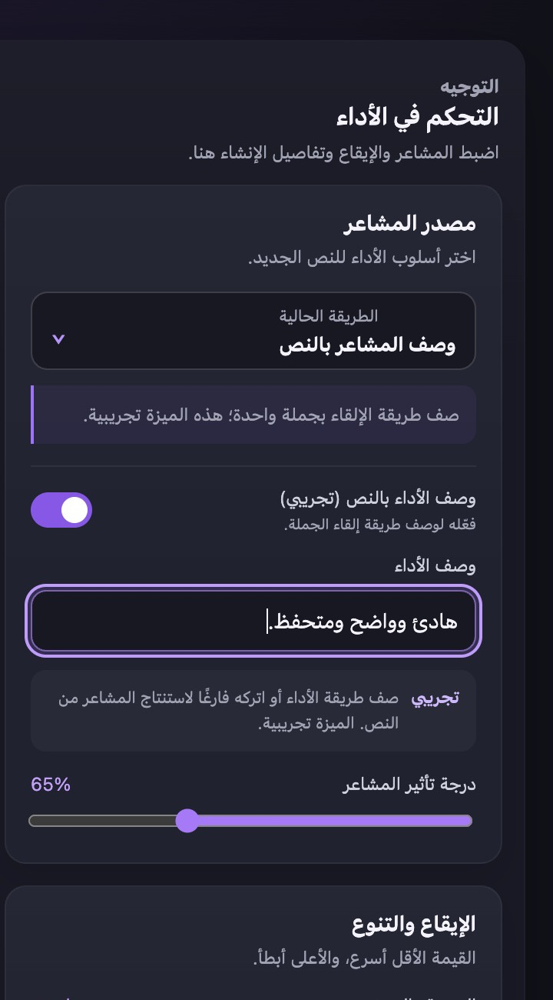
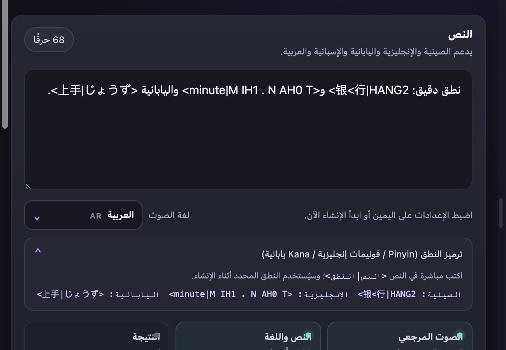
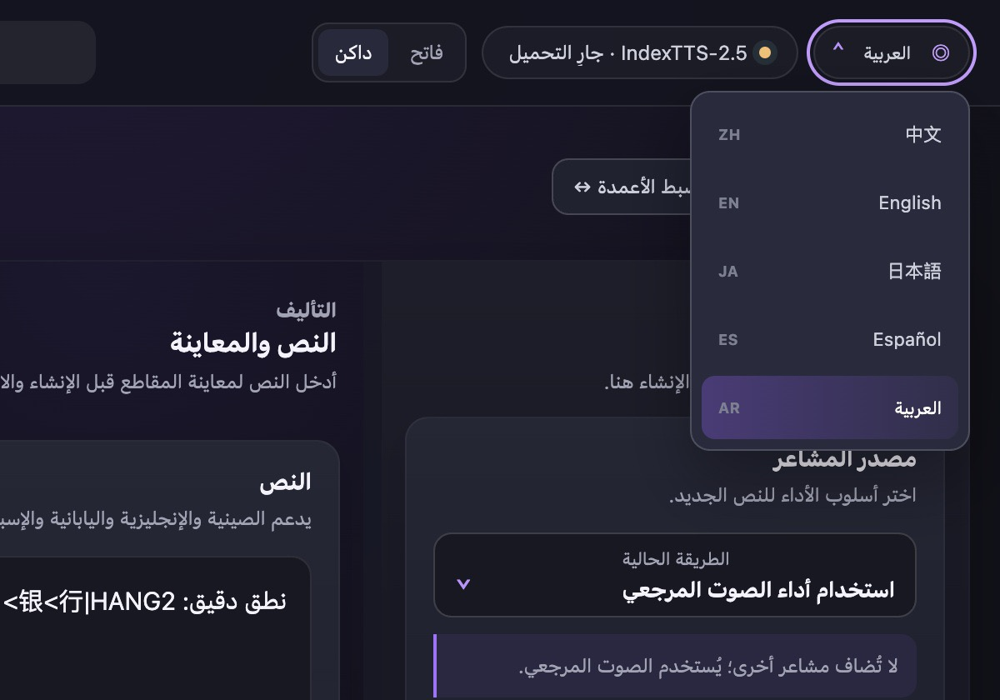
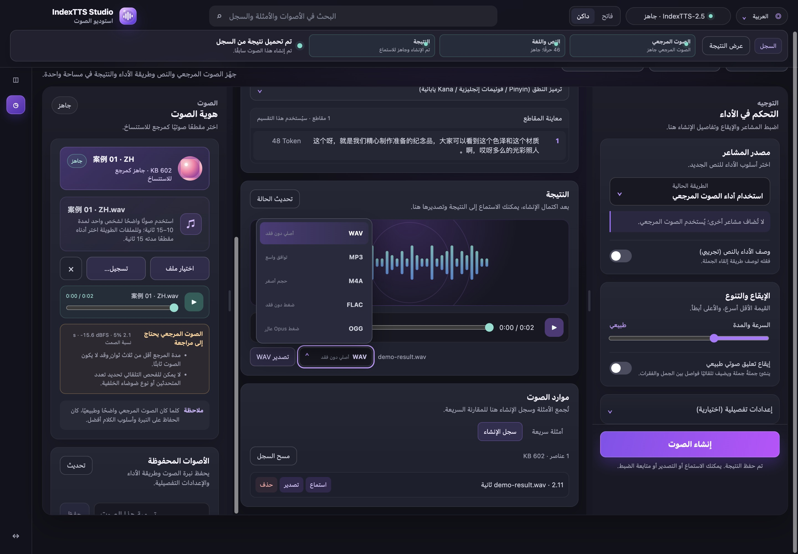
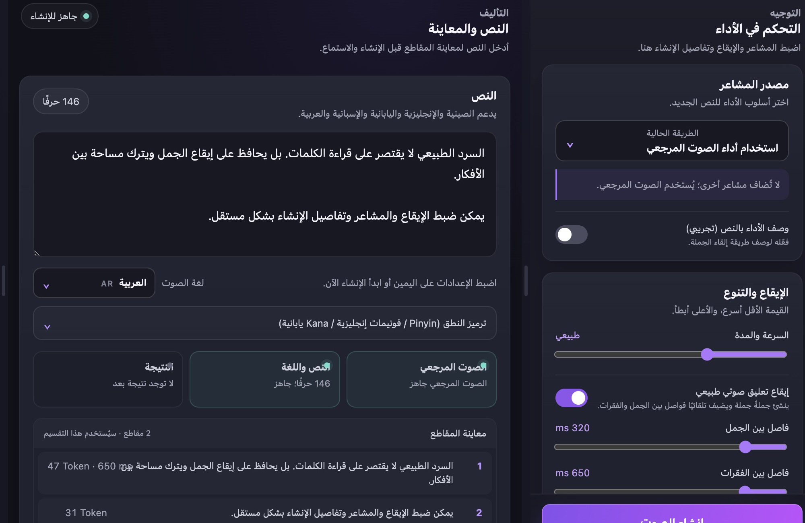

<div align="center">


# IndexTTS Studio

[简体中文](README.md) · [English](README_EN.md) · [日本語](README_JA.md) · [Español](README_ES.md) · [العربية](README_AR.md)

**مساحة عمل صوتية محلية ومتعددة اللغات مبنية على IndexTTS 2.5**

بيئة محلية لاستنساخ الصوت وتوليد الكلام بعدة لغات.

[](https://github.com/index-tts/index-tts)


[](LICENSE)

[دليل الاستخدام بالصينية](STUDIO_README_ZH.md) · [إشعار الترخيص](OPEN_SOURCE_NOTICE.md) · [مشروع IndexTTS](https://github.com/index-tts/index-tts)

</div>

<table>
  <tr>
    <td align="center">
      
      <br /><sub>الوضع الداكن</sub>
    </td>
    <td align="center">
      
      <br /><sub>الوضع الفاتح</sub>
    </td>
  </tr>
</table>

## معرض الميزات

<table>
  <tr>
    <td width="50%" align="center">
      
      <br /><strong>المقطع المرجعي وفحص الجودة</strong>
      <br /><sub>اختر مقطعًا مدته 15 ثانية وافحص المستوى والصمت والقص</sub>
    </td>
    <td width="50%" align="center">
      
      <br /><strong>التحكم في ثمانية مشاعر</strong>
      <br /><sub>اضبط ثمانية مشاعر ودرجة تأثيرها بشكل مستقل</sub>
    </td>
  </tr>
  <tr>
    <td width="50%" align="center">
      
      <br /><strong>وصف الأداء بالنص</strong>
      <br /><sub>صف النبرة وطريقة الإلقاء في جملة واحدة</sub>
    </td>
    <td width="50%" align="center">
      
      <br /><strong>ترميز دقيق للنطق</strong>
      <br /><sub>يدعم Pinyin الصينية وفونيمات CMU الإنجليزية وKana اليابانية</sub>
    </td>
  </tr>
  <tr>
    <td width="50%" align="center">
      
      <br /><strong>واجهة متعددة اللغات</strong>
      <br /><sub>اختر لغة الواجهة ولغة الصوت بشكل مستقل</sub>
    </td>
    <td width="50%" align="center">
      
      <br /><strong>الإنشاء والاستماع والتصدير</strong>
      <br /><sub>حالة Token مباشرة ومشغل صوت وخمس صيغ للتصدير</sub>
    </td>
  </tr>
</table>

<p align="center">
  
  <br /><strong>إيقاع طبيعي ومعاينة المقاطع</strong>
  <br /><sub>اضبط فواصل الجمل والفقرات وراجع التقسيم الذي سيستخدمه النموذج</sub>
</p>

## نظرة عامة

IndexTTS Studio مساحة عمل محلية تعمل في المتصفح للتحكم في IndexTTS 2.5. تجمع الصوت المرجعي والنص والتحكم في الأداء وتقدم الإنشاء والاستماع والتصدير في واجهة واحدة. تبقى المواد المرجعية والنتائج على الجهاز الذي يشغّل الخدمة.

يتضمن المشروع أيضًا سطر أوامر IndexTTS وواجهة Gradio WebUI. تُنزّل أوزان النموذج بشكل منفصل. راجع [LICENSE](LICENSE) لمعرفة شروط الاستخدام.

## الميزات الرئيسية

- استيراد الصوت أو الفيديو، أو التسجيل مباشرة من جهاز الإدخال المحدد.
- اختيار مقطع مرجعي مدته 15 ثانية من ملفات الصوت والفيديو الطويلة.
- إنشاء الكلام بالصينية والإنجليزية واليابانية والإسبانية والعربية، مع فصل لغة الواجهة عن لغة الصوت.
- استخدام مشاعر الصوت المرجعي أو مقطع عاطفي مستقل أو متجه من ثمانية مشاعر أو وصف نصي.
- ضبط السرعة والتوليد العشوائي ونطاق المرشحين ومنع التكرار وحدود المقاطع.
- تحديد النطق باستخدام Pinyin الصينية وفونيمات CMU الإنجليزية وKana اليابانية.
- فواصل طبيعية ومعاينة المقاطع وتقدم Token والإعدادات المحفوظة وسجل الإنشاء.
- فحص مدة الصوت المرجعي ومستواه والصمت والقص تلقائيًا، مع إمكانية إلغاء مهمة الإنشاء.
- حذف عنصر واحد أو السجل بالكامل، مع الاحتفاظ تلقائيًا بأحدث 100 عنصر أو حتى 5 GB.
- التصدير إلى WAV وMP3 وM4A وFLAC وOGG وفق دعم FFmpeg المثبت.
- مسار استدلال MPS ومسار توافق BigVGAN عبر CPU على أجهزة Mac بشرائح Apple M.

## البدء السريع

المتطلبات: Python 3.10 أو 3.11 و[uv](https://docs.astral.sh/uv/) وFFmpeg.

```bash
git clone https://github.com/luu175ktovtsvor-spec/IndexTTS-Studio-Open.git
cd IndexTTS-Studio-Open

uv sync --extra studio --locked
```

نزّل أوزان نموذج IndexTTS 2.5:

```bash
uv tool install huggingface-hub
hf download IndexTeam/IndexTTS-2.5 --local-dir=checkpoints
uv run python -m indextts.utils.model_integrity checkpoints
```

شغّل Studio:

```bash
uv run --extra studio --locked python studio_server.py
```

افتح [http://127.0.0.1:7860](http://127.0.0.1:7860). على macOS وLinux يمكن أيضًا تشغيل:

```bash
./start-studio.sh
```

لاستخدام منفذ آخر:

```bash
INDEXTTS_STUDIO_PORT=7861 ./start-studio.sh
```

## الأنظمة المدعومة

- توفر CUDA وDeepSpeed وأنوية CUDA تسريعًا على بطاقات NVIDIA GPU.
- يستهدف مسار Mac شرائح Apple M1 وما بعدها، بما فيها Pro وMax وUltra.
- يحتفظ Windows وLinux بمسار التشغيل عبر Python، لكنهما لم يخضعا لاختبار فعلي ضمن هذا التحقق على Mac. يتطلب التسجيل عن بُعد HTTPS.

## بنية المشروع

```text
studio/                 واجهة Studio وموارد اللغات
studio_server.py        API محلية وحالة الإنشاء وخدمة الملفات
studio_engine.py        طبقة توافق Apple silicon
start-studio.sh         تشغيل macOS / Linux
STUDIO_README_ZH.md     دليل تفصيلي بالصينية
OPEN_SOURCE_NOTICE.md   الترخيص وتفاصيل التعديلات
```

## المشروع والترخيص

يعتمد IndexTTS Studio على [IndexTTS 2.5](https://github.com/index-tts/index-tts). راجع مشروع IndexTTS للحصول على معلومات النموذج والبحث والأوزان. توضح ملفات [LICENSE](LICENSE) و[OPEN_SOURCE_NOTICE.md](OPEN_SOURCE_NOTICE.md) شروط الترخيص والتعديلات.

- [مشروع IndexTTS](https://github.com/index-tts/index-tts)
- [وثائق IndexTTS بالعربية](docs/README_ar.md)
- [دليل Studio بالصينية](STUDIO_README_ZH.md)
- [الترخيص](LICENSE)
- [إشعار التعديلات](OPEN_SOURCE_NOTICE.md)
