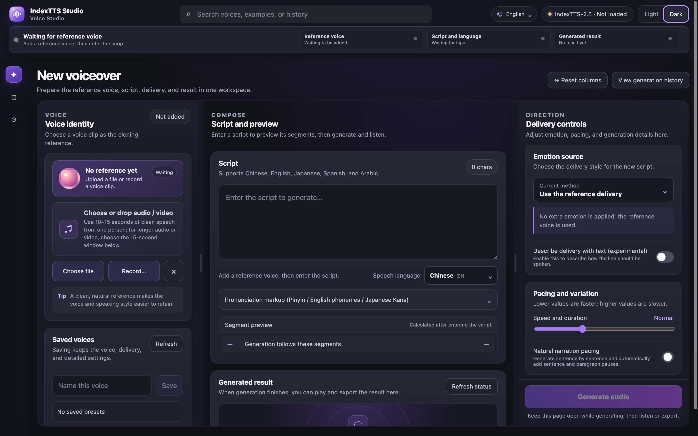
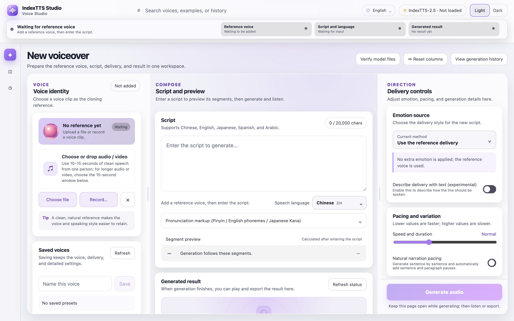
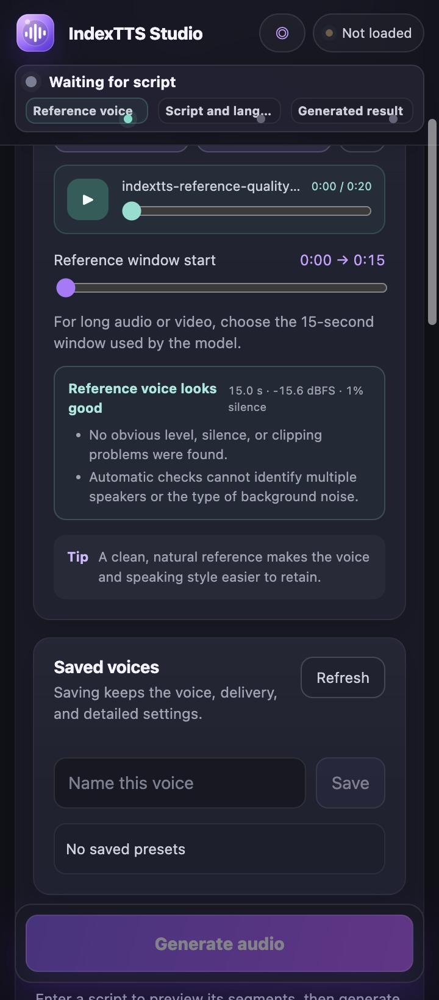
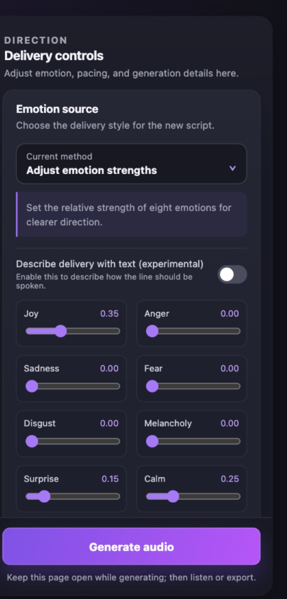
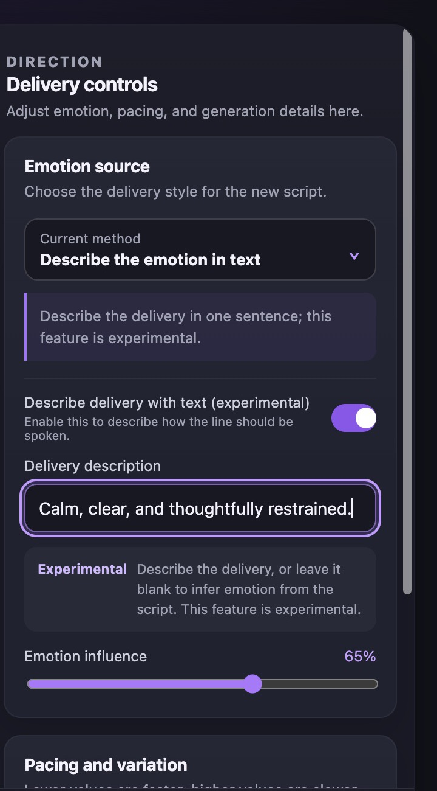
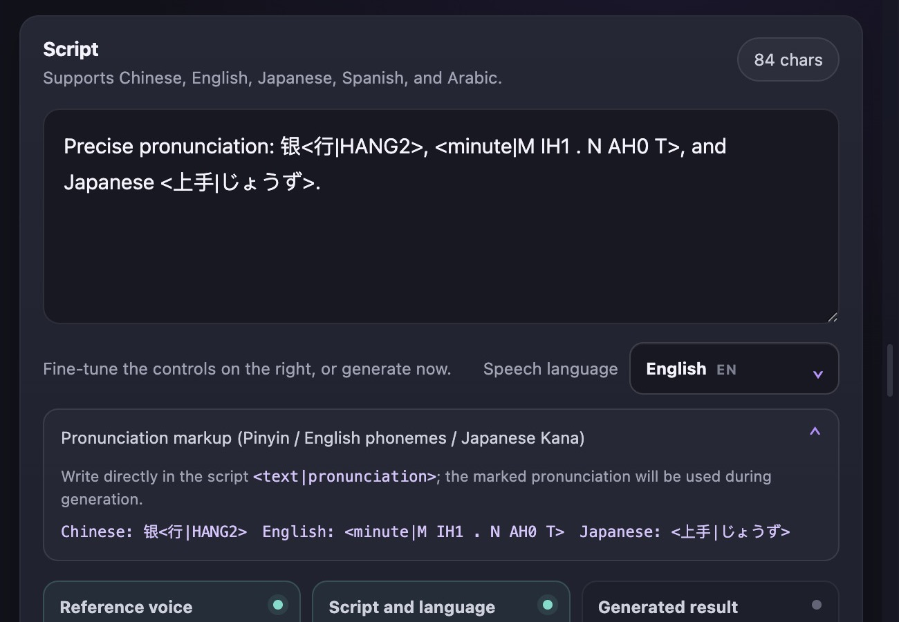
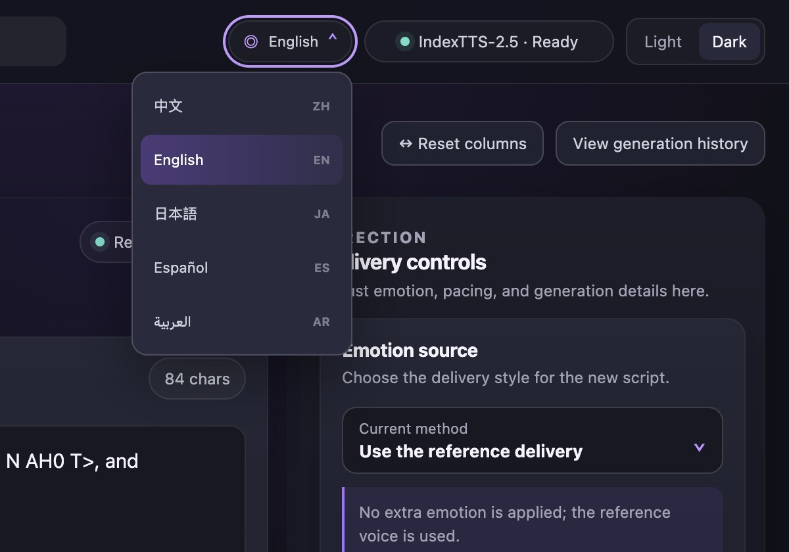
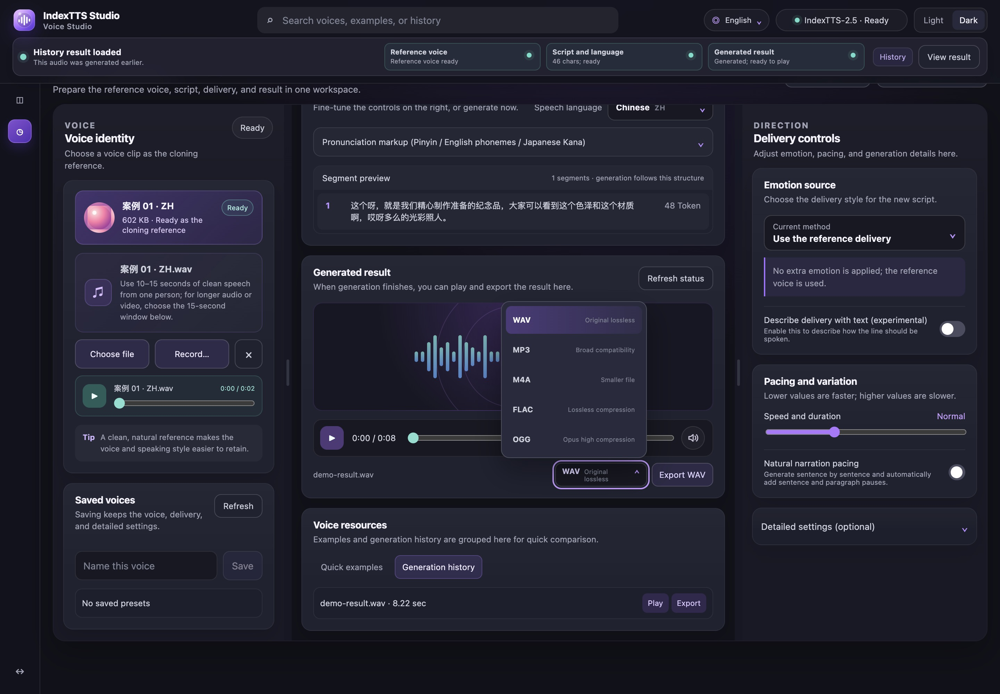
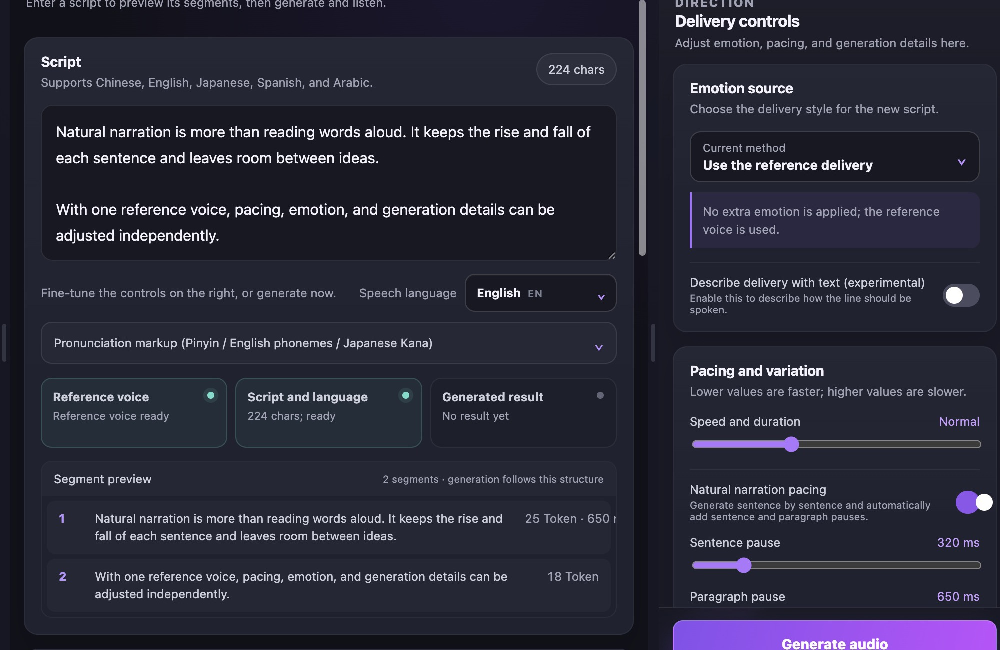

<div align="center">


# IndexTTS Studio

[简体中文](README.md) · [English](README_EN.md) · [日本語](README_JA.md) · [Español](README_ES.md) · [العربية](README_AR.md)

**A local multilingual voice workspace powered by IndexTTS 2.5**

Local-first multilingual voice cloning and speech generation workspace.

[](https://github.com/index-tts/index-tts)


[](LICENSE)

[Guide](STUDIO_README_ZH.md) · [License notice](OPEN_SOURCE_NOTICE.md) · [IndexTTS project](https://github.com/index-tts/index-tts)

</div>

<table>
  <tr>
    <td align="center">
      
      <br /><sub>Dark mode</sub>
    </td>
    <td align="center">
      
      <br /><sub>Light mode</sub>
    </td>
  </tr>
</table>

## Feature gallery

<table>
  <tr>
    <td width="50%" align="center">
      
      <br /><strong>Reference segment and quality check</strong>
      <br /><sub>Select the 15-second segment and check level, silence, and clipping</sub>
    </td>
    <td width="50%" align="center">
      
      <br /><strong>Eight-dimensional emotion control</strong>
      <br /><sub>Adjust eight emotions and their influence independently</sub>
    </td>
  </tr>
  <tr>
    <td width="50%" align="center">
      
      <br /><strong>Text-described performance</strong>
      <br /><sub>Describe the intended tone and delivery in one sentence</sub>
    </td>
    <td width="50%" align="center">
      
      <br /><strong>Precise pronunciation annotations</strong>
      <br /><sub>Chinese pinyin, English CMU phonemes, and Japanese kana</sub>
    </td>
  </tr>
  <tr>
    <td width="50%" align="center">
      
      <br /><strong>Multilingual interface</strong>
      <br /><sub>Choose the interface language and generation language separately</sub>
    </td>
    <td width="50%" align="center">
      
      <br /><strong>Generation, playback, and export</strong>
      <br /><sub>Live token status, an audio player, and five export formats</sub>
    </td>
  </tr>
</table>

<p align="center">
  
  <br /><strong>Natural pacing and sentence preview</strong>
  <br /><sub>Set sentence and paragraph pauses separately and preview the segmentation used by the model</sub>
</p>

## Overview

IndexTTS Studio is a browser-based local workspace for IndexTTS 2.5. It brings reference voice handling, scripts, performance controls, generation progress, playback, and export into one interface. Reference media and generated results remain on the device running the service.

The project also provides the IndexTTS command line and Gradio WebUI. Model weights are downloaded separately. See [LICENSE](LICENSE) for licensing terms.

## Highlights

- Import audio or video, or record directly from a selected input device.
- Choose the 15-second reference segment used by the model from long audio and video files.
- Generate Chinese, English, Japanese, Spanish, and Arabic speech; interface and generation languages are independent.
- Use reference-audio emotion, a separate emotion clip, an eight-dimensional emotion vector, or a text emotion description.
- Control speed, random sampling, candidate range, repetition penalty, and segment limits.
- Add Chinese pinyin, English CMU phoneme, and Japanese kana pronunciation annotations.
- Configure natural speech pauses and view sentence segmentation, live token progress, presets, and generation history.
- Check reference duration, level, silence, and clipping automatically; active generation can be cancelled.
- Delete individual or all history items; the latest 100 items or up to 5 GB are retained automatically.
- Export WAV, MP3, M4A, FLAC, or OGG when supported by the installed FFmpeg build.
- Use an MPS inference path and BigVGAN CPU compatibility path on Apple M-series Macs.

## Quick start

Requirements: Python 3.10 or 3.11, [uv](https://docs.astral.sh/uv/), and FFmpeg.

```bash
git clone https://github.com/luu175ktovtsvor-spec/IndexTTS-Studio-Open.git
cd IndexTTS-Studio-Open

uv sync --extra studio --locked
```

Download the IndexTTS 2.5 model weights:

```bash
uv tool install huggingface-hub
hf download IndexTeam/IndexTTS-2.5 --local-dir=checkpoints
uv run python -m indextts.utils.model_integrity checkpoints
```

Start Studio:

```bash
uv run --extra studio --locked python studio_server.py
```

Open [http://127.0.0.1:7860](http://127.0.0.1:7860). On macOS and Linux, you can also run:

```bash
./start-studio.sh
```

To use another port:

```bash
INDEXTTS_STUDIO_PORT=7861 ./start-studio.sh
```

`INDEXTTS_STUDIO_PORT` only changes the custom Studio port; it does not start the upstream Gradio page. Studio on 7860 is the default and public interface. To use the optional upstream WebUI in another terminal:

```bash
./start-native-webui.sh
# Equivalent: uv run --extra webui --locked python webui.py --host 127.0.0.1 --port 7861
```

Both pages can be open together, but they use separate model processes, so dual launch is not the default. Closing either launch terminal safely stops its service.

Temporary native-WebUI audio is scoped to this project at `outputs/gradio-cache`. It is cleared before launch and after a normal exit; Gradio periodically removes cache older than 15 minutes while running. Shared system temp folders are never cleaned.

Run the reproducible Studio regression suite:

```bash
./tools/test-studio.sh
```

## Platform notes

- CUDA, DeepSpeed, and CUDA kernels provide NVIDIA GPU acceleration.
- The Mac path targets M1 and later Apple M-series chips, including Pro, Max, and Ultra variants.
- Windows and Linux retain the Python launch path but were not hardware-tested in this Mac-side validation. Browser recording requires HTTPS when deployed remotely.

## Project structure

```text
studio/                 Studio frontend and language resources
studio_server.py        Local API, generation state, and file serving
studio_engine.py        Apple silicon compatibility layer
start-studio.sh         macOS / Linux launch script
start-native-webui.sh   Optional upstream Gradio launcher
tools/test-studio.sh    Reproducible Studio regression suite
STUDIO_README_ZH.md     Detailed guide in Chinese
OPEN_SOURCE_NOTICE.md   License and modification notice
```

## Project and license

IndexTTS Studio is built on [IndexTTS 2.5](https://github.com/index-tts/index-tts). See the IndexTTS project for model, paper, and weight information. Licensing and modification details are provided in [LICENSE](LICENSE) and [OPEN_SOURCE_NOTICE.md](OPEN_SOURCE_NOTICE.md).

- [IndexTTS project](https://github.com/index-tts/index-tts)
- [IndexTTS documentation in Chinese](docs/README_zh.md)
- [Studio guide in Chinese](STUDIO_README_ZH.md)
- [License](LICENSE)
- [Modification notice](OPEN_SOURCE_NOTICE.md)
