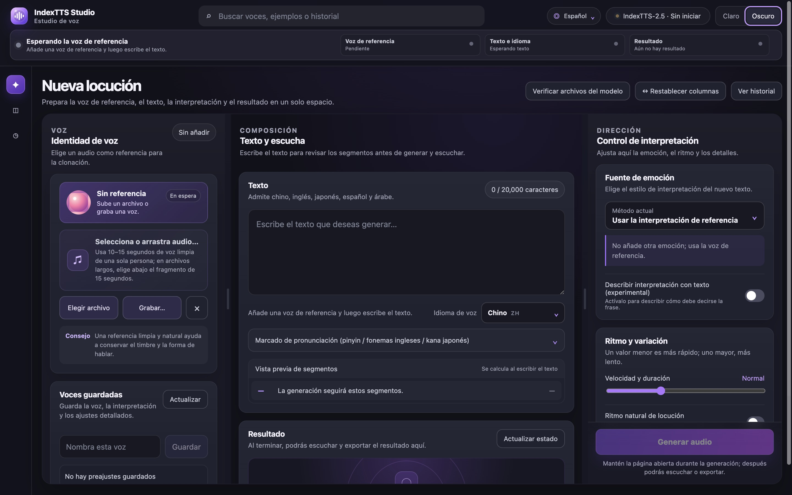
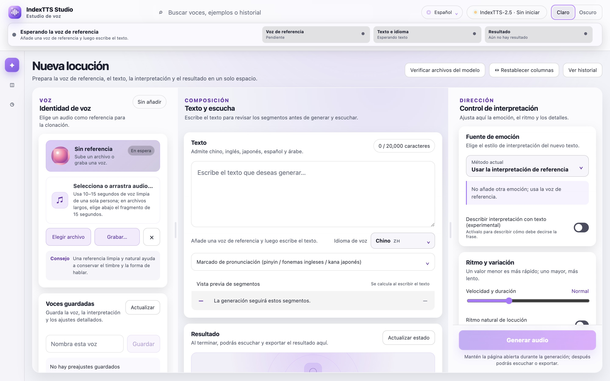
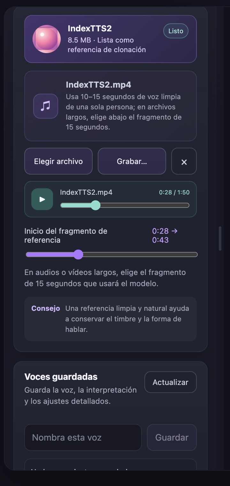
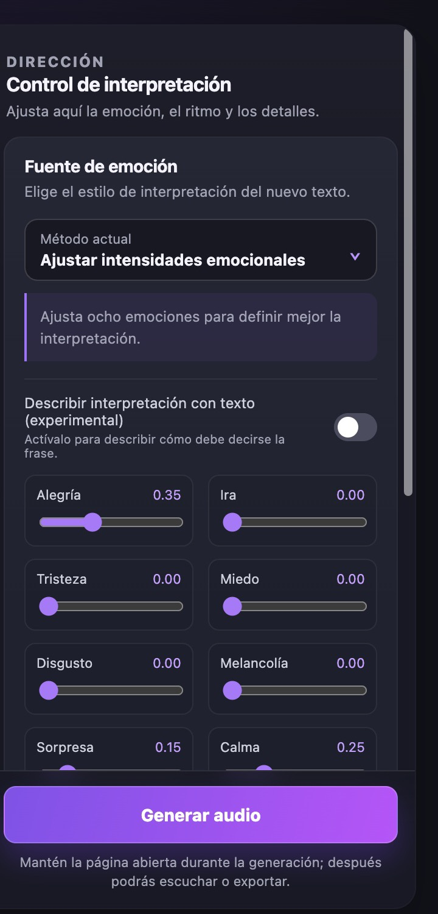
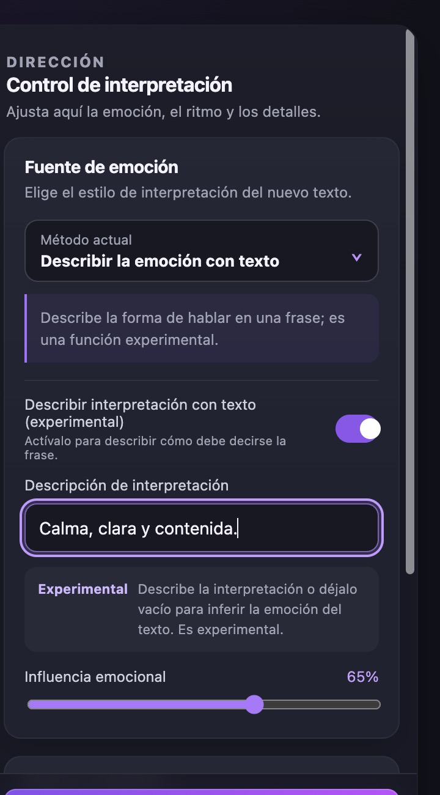
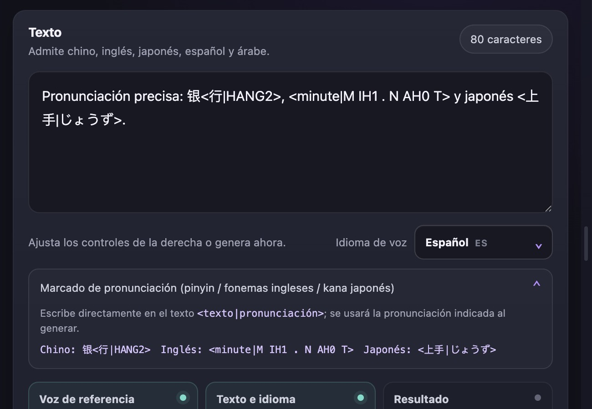
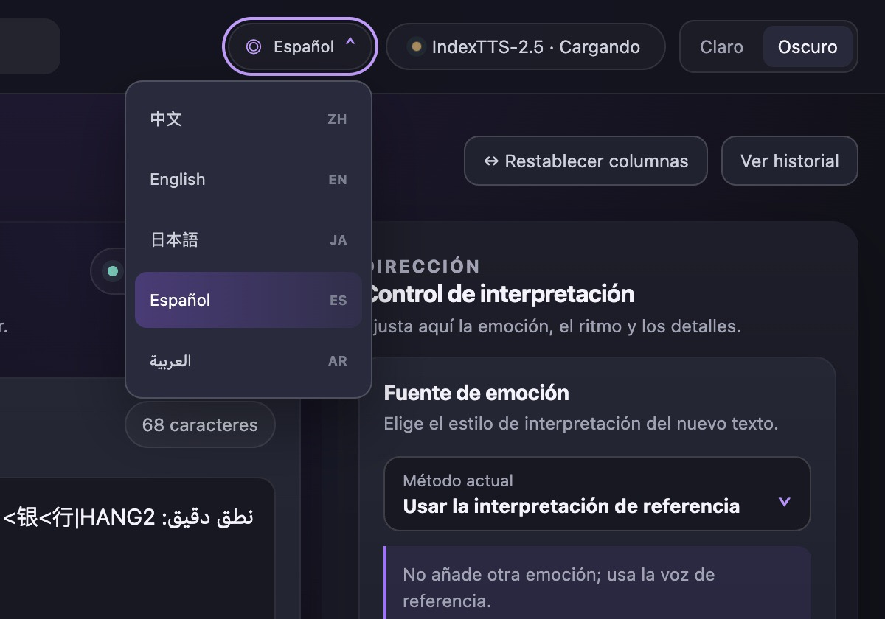
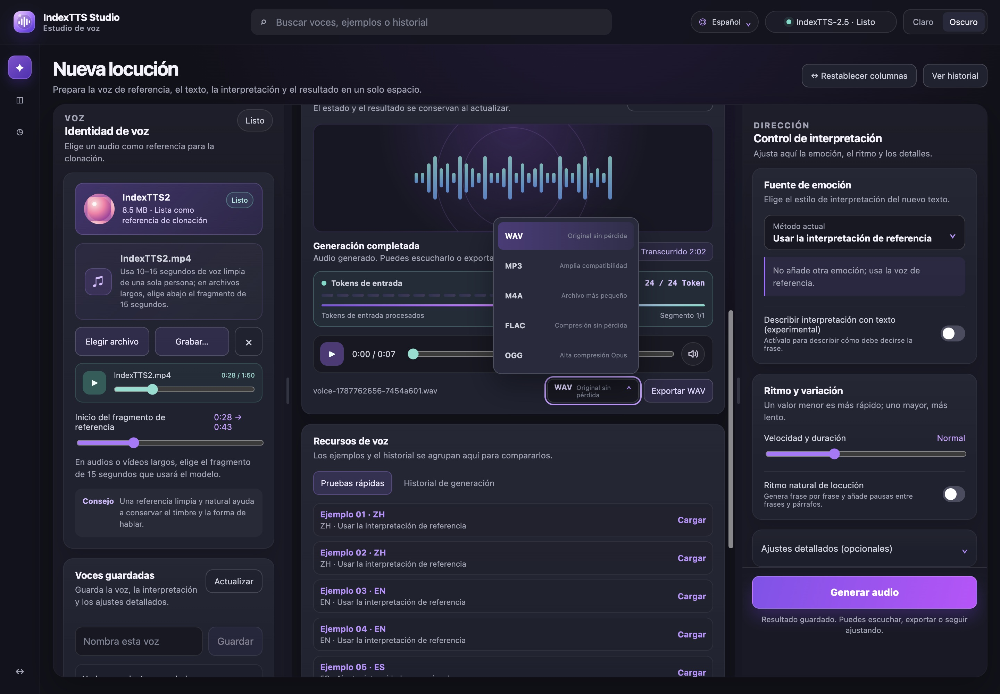
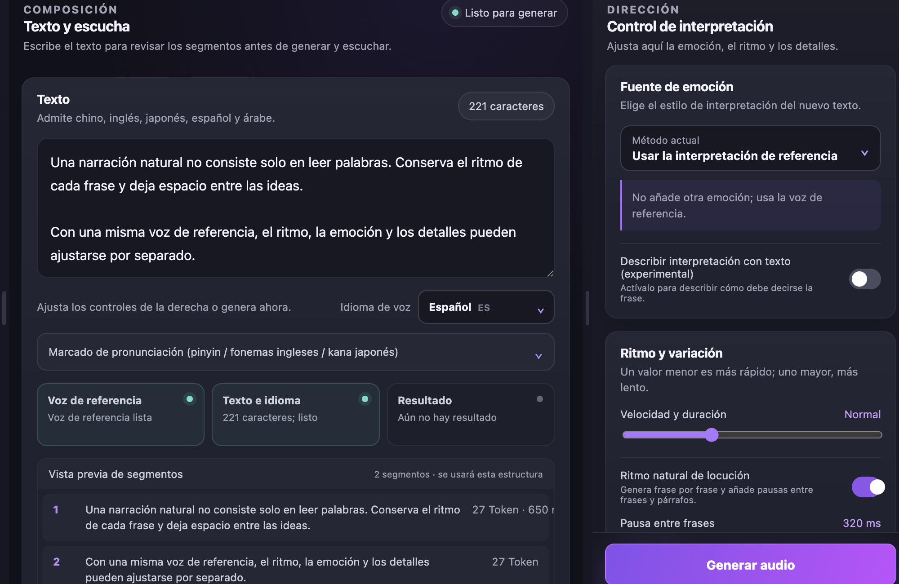

<div align="center">


# IndexTTS Studio

[简体中文](README.md) · [English](README_EN.md) · [日本語](README_JA.md) · [Español](README_ES.md) · [العربية](README_AR.md)

**Espacio de trabajo local y multilingüe basado en IndexTTS 2.5**

Un entorno local para clonación de voz y generación de voz en varios idiomas.

[](https://github.com/index-tts/index-tts)


[](LICENSE)

[Guía en chino](STUDIO_README_ZH.md) · [Aviso de licencia](OPEN_SOURCE_NOTICE.md) · [Proyecto IndexTTS](https://github.com/index-tts/index-tts)

</div>

<table>
  <tr>
    <td align="center">
      
      <br /><sub>Modo oscuro</sub>
    </td>
    <td align="center">
      
      <br /><sub>Modo claro</sub>
    </td>
  </tr>
</table>

## Galería de funciones

<table>
  <tr>
    <td width="50%" align="center">
      
      <br /><strong>Fragmento de referencia y control de calidad</strong>
      <br /><sub>Selecciona 15 segundos y comprueba nivel, silencio y recorte</sub>
    </td>
    <td width="50%" align="center">
      
      <br /><strong>Control emocional de ocho dimensiones</strong>
      <br /><sub>Ajusta ocho emociones y su influencia por separado</sub>
    </td>
  </tr>
  <tr>
    <td width="50%" align="center">
      
      <br /><strong>Interpretación descrita con texto</strong>
      <br /><sub>Describe el tono y la forma de hablar en una frase</sub>
    </td>
    <td width="50%" align="center">
      
      <br /><strong>Marcado preciso de pronunciación</strong>
      <br /><sub>Pinyin chino, fonemas CMU en inglés y kana japonés</sub>
    </td>
  </tr>
  <tr>
    <td width="50%" align="center">
      
      <br /><strong>Interfaz multilingüe</strong>
      <br /><sub>Elige por separado el idioma de la interfaz y el de la voz</sub>
    </td>
    <td width="50%" align="center">
      
      <br /><strong>Generación, escucha y exportación</strong>
      <br /><sub>Estado de Token en tiempo real, reproductor y cinco formatos</sub>
    </td>
  </tr>
</table>

<p align="center">
  
  <br /><strong>Ritmo natural y vista previa de segmentos</strong>
  <br /><sub>Configura pausas entre frases y párrafos y revisa la segmentación</sub>
</p>

## Descripción

IndexTTS Studio es un espacio de trabajo local para controlar IndexTTS 2.5 desde el navegador. Reúne la voz de referencia, el texto, los controles de interpretación, el progreso, la escucha y la exportación en una sola interfaz. Los archivos de referencia y los resultados permanecen en el equipo que ejecuta el servicio.

El proyecto también incluye la línea de comandos de IndexTTS y la WebUI de Gradio. Los pesos del modelo se descargan por separado. Consulta [LICENSE](LICENSE) para conocer las condiciones de uso.

## Funciones principales

- Importación de audio o vídeo y grabación directa desde el dispositivo de entrada elegido.
- Selección del fragmento de referencia de 15 segundos en audios y vídeos largos.
- Generación en chino, inglés, japonés, español y árabe; el idioma de la interfaz es independiente.
- Emoción de la referencia, clip emocional separado, vector de ocho emociones o descripción textual.
- Control de velocidad, generación aleatoria, rango de candidatos, repetición y límites por segmento.
- Marcado de pronunciación con pinyin chino, fonemas CMU en inglés y kana japonés.
- Pausas naturales, vista previa de segmentos, progreso de Token, preajustes e historial.
- Comprobación automática de duración, nivel, silencio y recorte de la referencia; la generación activa se puede cancelar.
- Eliminación individual o total del historial; se conservan los últimos 100 elementos o hasta 5 GB.
- Exportación a WAV, MP3, M4A, FLAC y OGG cuando FFmpeg lo permita.
- Ruta de inferencia MPS y compatibilidad de BigVGAN por CPU en Mac con chips Apple M.

## Inicio rápido

Requisitos: Python 3.10 o 3.11, [uv](https://docs.astral.sh/uv/) y FFmpeg.

```bash
git clone https://github.com/luu175ktovtsvor-spec/IndexTTS-Studio-Open.git
cd IndexTTS-Studio-Open

uv sync --extra studio --locked
```

Descarga los pesos de IndexTTS 2.5:

```bash
uv tool install huggingface-hub
hf download IndexTeam/IndexTTS-2.5 --local-dir=checkpoints
uv run python -m indextts.utils.model_integrity checkpoints
```

Inicia Studio:

```bash
uv run --extra studio --locked python studio_server.py
```

Abre [http://127.0.0.1:7860](http://127.0.0.1:7860). En macOS y Linux también puedes ejecutar:

```bash
./start-studio.sh
```

Para utilizar otro puerto:

```bash
INDEXTTS_STUDIO_PORT=7861 ./start-studio.sh
```

`INDEXTTS_STUDIO_PORT` solo cambia el puerto del Studio personalizado; no inicia la página Gradio original. Studio en 7860 es la interfaz predeterminada y pública. Para usar la WebUI original opcional en otra terminal:

```bash
./start-native-webui.sh
# Equivalente: uv run --extra webui --locked python webui.py --host 127.0.0.1 --port 7861
```

Ambas páginas pueden estar abiertas a la vez, pero usan procesos de modelo separados, por lo que el inicio doble no es predeterminado. Cerrar cada terminal detiene de forma segura su servicio.

El audio temporal de la WebUI original se limita a `outputs/gradio-cache` dentro del proyecto. Se limpia antes del inicio y tras una salida normal; durante la ejecución, Gradio elimina periódicamente la caché de más de 15 minutos. No se limpian carpetas temporales compartidas del sistema.

Ejecuta las pruebas reproducibles de Studio:

```bash
./tools/test-studio.sh
```

## Compatibilidad

- CUDA, DeepSpeed y los kernels CUDA aceleran la ejecución en GPU NVIDIA.
- La ruta para Mac está dirigida a chips Apple M1 y posteriores, incluidas las variantes Pro, Max y Ultra.
- Windows y Linux conservan el inicio mediante Python, pero no se probaron en hardware durante esta validación en Mac. La grabación remota requiere HTTPS.

## Estructura del proyecto

```text
studio/                 Interfaz de Studio y recursos de idioma
studio_server.py        API local, estado de generación y archivos
studio_engine.py        Capa de compatibilidad con Apple silicon
start-studio.sh         Inicio en macOS / Linux
start-native-webui.sh   Inicio opcional de Gradio original
tools/test-studio.sh    Pruebas reproducibles de Studio
STUDIO_README_ZH.md     Guía detallada en chino
OPEN_SOURCE_NOTICE.md   Licencia y modificaciones
```

## Proyecto y licencia

IndexTTS Studio está basado en [IndexTTS 2.5](https://github.com/index-tts/index-tts). Consulta el proyecto IndexTTS para obtener información sobre el modelo, el artículo y los pesos. La licencia y las modificaciones se describen en [LICENSE](LICENSE) y [OPEN_SOURCE_NOTICE.md](OPEN_SOURCE_NOTICE.md).

- [Proyecto IndexTTS](https://github.com/index-tts/index-tts)
- [Documentación de IndexTTS en español](docs/README_es.md)
- [Guía de Studio en chino](STUDIO_README_ZH.md)
- [Licencia](LICENSE)
- [Aviso de modificaciones](OPEN_SOURCE_NOTICE.md)
