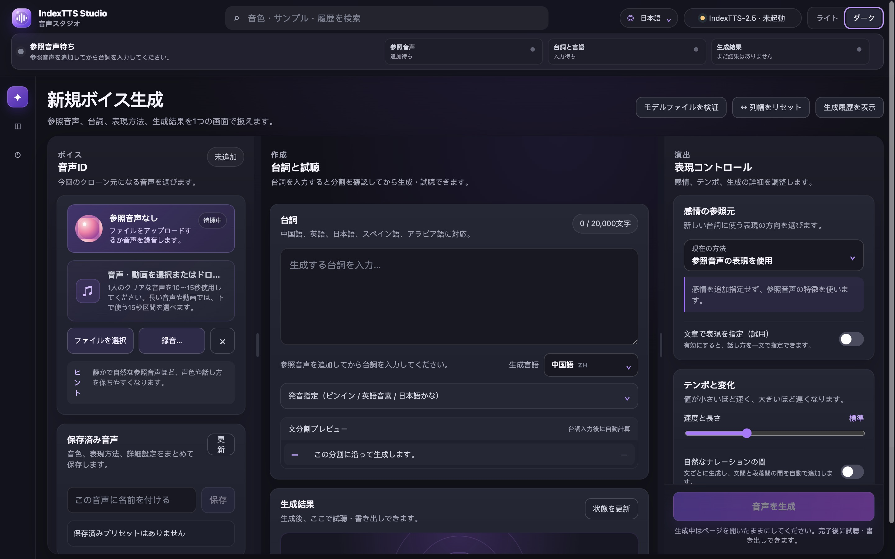
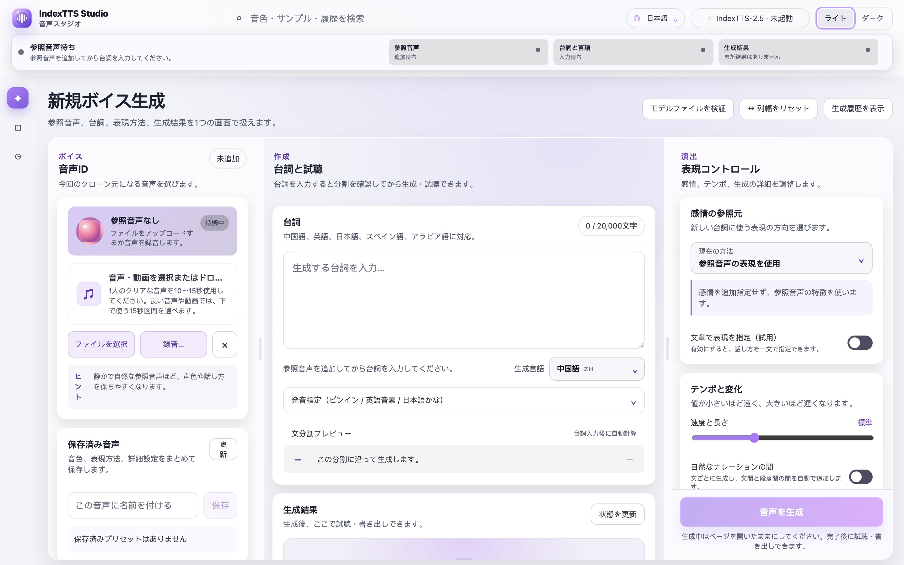
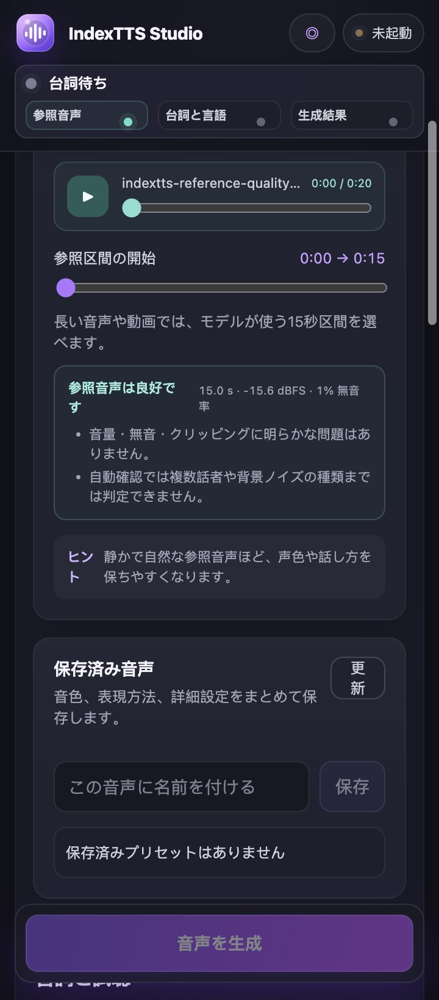
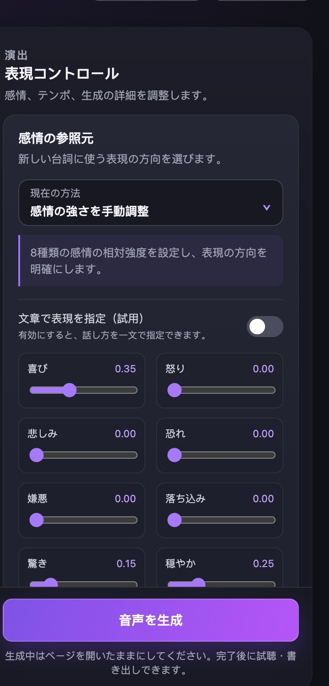
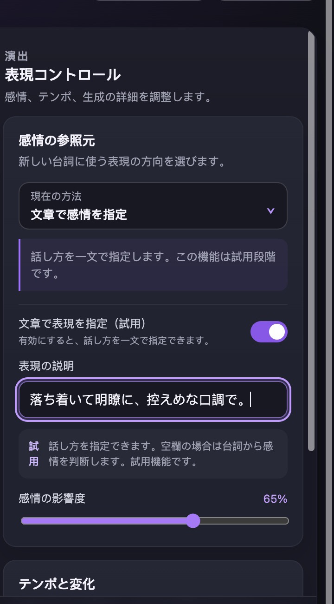
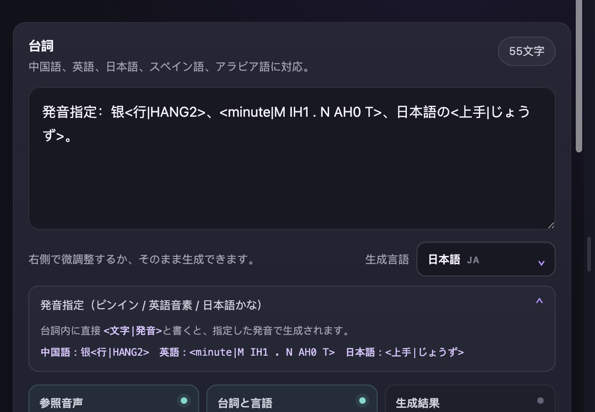
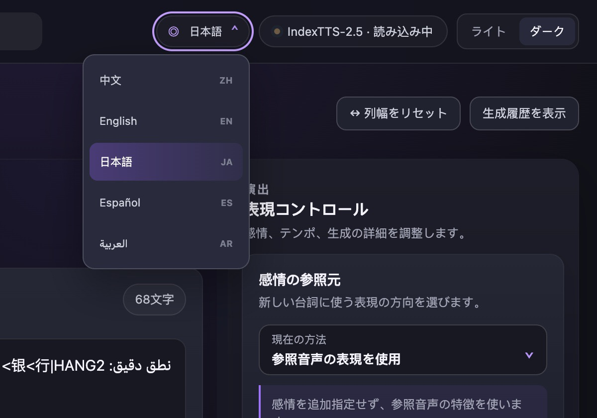
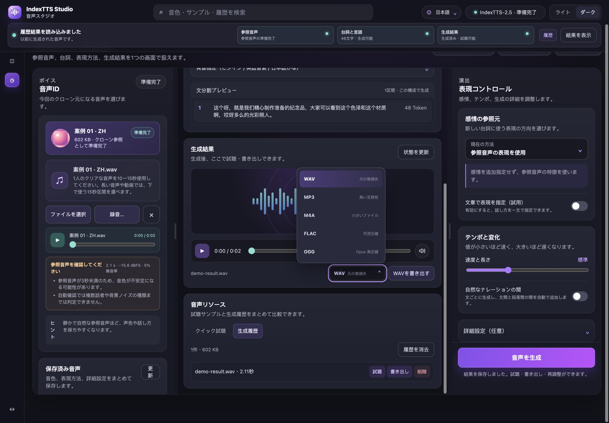
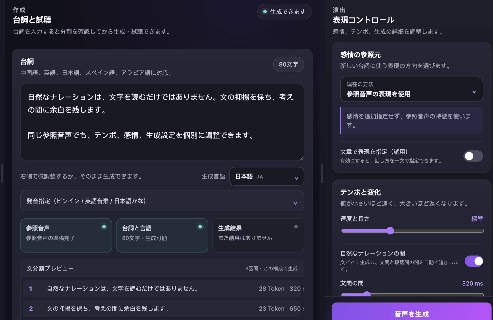

<div align="center">


# IndexTTS Studio

[简体中文](README.md) · [English](README_EN.md) · [日本語](README_JA.md) · [Español](README_ES.md) · [العربية](README_AR.md)

**IndexTTS 2.5 を使用したローカル多言語音声ワークスペース**

音声クローンと音声生成をローカル環境で扱うための多言語ワークスペースです。

[](https://github.com/index-tts/index-tts)


[](LICENSE)

[使用ガイド（中国語）](STUDIO_README_ZH.md) · [ライセンス表記](OPEN_SOURCE_NOTICE.md) · [IndexTTS プロジェクト](https://github.com/index-tts/index-tts)

</div>

<table>
  <tr>
    <td align="center">
      
      <br /><sub>ダークモード</sub>
    </td>
    <td align="center">
      
      <br /><sub>ライトモード</sub>
    </td>
  </tr>
</table>

## 機能ギャラリー

<table>
  <tr>
    <td width="50%" align="center">
      
      <br /><strong>参照区間と品質確認</strong>
      <br /><sub>15秒区間を選択し、音量・無音・クリッピングを確認</sub>
    </td>
    <td width="50%" align="center">
      
      <br /><strong>8次元感情制御</strong>
      <br /><sub>8種類の感情と影響度を個別に調整</sub>
    </td>
  </tr>
  <tr>
    <td width="50%" align="center">
      
      <br /><strong>文章による表現指定</strong>
      <br /><sub>話し方や口調を一文で指定</sub>
    </td>
    <td width="50%" align="center">
      
      <br /><strong>精密な発音指定</strong>
      <br /><sub>中国語ピンイン、英語 CMU 音素、日本語かなに対応</sub>
    </td>
  </tr>
  <tr>
    <td width="50%" align="center">
      
      <br /><strong>多言語インターフェース</strong>
      <br /><sub>表示言語と生成言語を個別に選択</sub>
    </td>
    <td width="50%" align="center">
      
      <br /><strong>生成、試聴、書き出し</strong>
      <br /><sub>リアルタイム Token、プレーヤー、5種類の書き出し形式</sub>
    </td>
  </tr>
</table>

<p align="center">
  
  <br /><strong>自然なナレーションと文分割</strong>
  <br /><sub>文間・段落間の間を個別に設定し、モデルが使う分割を確認</sub>
</p>

## 概要

IndexTTS Studio は、IndexTTS 2.5 をブラウザから操作するローカルワークスペースです。参照音声、台詞、表現制御、生成進捗、試聴、書き出しを1つの画面にまとめています。参照素材と生成結果は、サービスを実行している端末に保存されます。

IndexTTS のコマンドラインと Gradio WebUI も利用できます。モデル重みは別途ダウンロードしてください。ライセンス条件は [LICENSE](LICENSE) を参照してください。

## 主な機能

- 音声・動画の読み込み、入力デバイスを選んだ直接録音。
- 長い音声や動画からモデルが使う15秒の参照区間を選択。
- 中国語、英語、日本語、スペイン語、アラビア語の生成。表示言語と生成言語は独立。
- 参照音声の感情、別の感情音声、8次元感情ベクトル、文章による感情指定。
- 速度、ランダム生成、候補範囲、繰り返し抑制、分割上限の調整。
- 中国語ピンイン、英語 CMU 音素、日本語かなによる発音指定。
- 自然な間、文分割プレビュー、リアルタイム Token、プリセット、生成履歴。
- 参照音声の長さ・音量・無音・クリッピングを自動確認し、生成タスクをキャンセル可能。
- 履歴を個別または一括削除でき、最新100件または最大5 GBまで自動保持。
- FFmpeg が対応している WAV、MP3、M4A、FLAC、OGG の書き出し。
- Apple M シリーズ Mac 向けの MPS 推論と BigVGAN CPU 互換経路。

## クイックスタート

必要環境：Python 3.10 または 3.11、[uv](https://docs.astral.sh/uv/)、FFmpeg。

```bash
git clone https://github.com/luu175ktovtsvor-spec/IndexTTS-Studio-Open.git
cd IndexTTS-Studio-Open

uv sync --extra studio --locked
```

IndexTTS 2.5 のモデル重みをダウンロードします。

```bash
uv tool install huggingface-hub
hf download IndexTeam/IndexTTS-2.5 --local-dir=checkpoints
uv run python -m indextts.utils.model_integrity checkpoints
```

Studio を起動します。

```bash
uv run --extra studio --locked python studio_server.py
```

[http://127.0.0.1:7860](http://127.0.0.1:7860) を開きます。macOS と Linux では次のスクリプトも利用できます。

```bash
./start-studio.sh
```

別のポートを使う場合：

```bash
INDEXTTS_STUDIO_PORT=7861 ./start-studio.sh
```

## 対応環境

- NVIDIA GPU では CUDA、DeepSpeed、CUDA カーネルによる高速化を利用します。
- Mac 向け経路は M1 以降の Apple M シリーズ（Pro、Max、Ultra を含む）に対応します。
- Windows と Linux の Python 起動経路は維持していますが、今回の Mac 側検証では実機確認していません。リモート録音には HTTPS が必要です。

## プロジェクト構成

```text
studio/                 Studio フロントエンドと言語リソース
studio_server.py        ローカル API、生成状態、ファイル配信
studio_engine.py        Apple silicon 互換レイヤー
start-studio.sh         macOS / Linux 起動スクリプト
STUDIO_README_ZH.md     詳細ガイド（中国語）
OPEN_SOURCE_NOTICE.md   ライセンスと変更内容
```

## プロジェクトとライセンス

IndexTTS Studio は [IndexTTS 2.5](https://github.com/index-tts/index-tts) を基盤としています。モデル、論文、重みに関する情報は IndexTTS プロジェクトを参照してください。ライセンスと変更内容は [LICENSE](LICENSE) および [OPEN_SOURCE_NOTICE.md](OPEN_SOURCE_NOTICE.md) に記載しています。

- [IndexTTS プロジェクト](https://github.com/index-tts/index-tts)
- [IndexTTS 日本語ドキュメント](docs/README_ja.md)
- [Studio 使用ガイド（中国語）](STUDIO_README_ZH.md)
- [ライセンス](LICENSE)
- [変更内容](OPEN_SOURCE_NOTICE.md)
